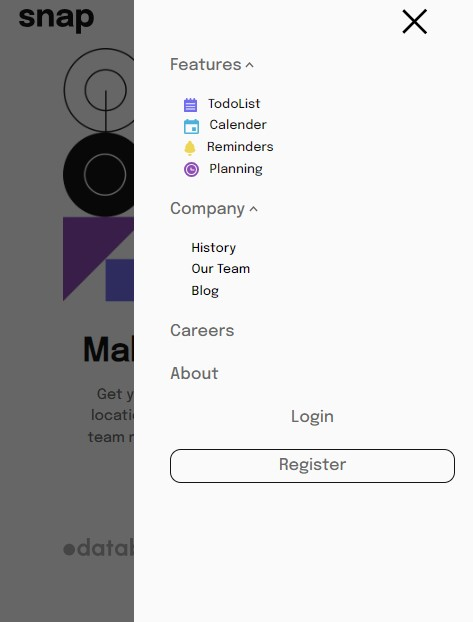

# Frontend Mentor - Intro section with dropdown navigation solution

This is a solution to the [Intro section with dropdown navigation challenge on Frontend Mentor](https://www.frontendmentor.io/challenges/intro-section-with-dropdown-navigation-ryaPetHE5). Frontend Mentor challenges help you improve your coding skills by building realistic projects.

## Table of contents

- [Overview](#overview)
  - [The challenge](#the-challenge)
  - [Screenshot](#screenshot)
  - [Links](#links)
  - [Built with](#built-with)
  - [What I learned](#what-i-learned)
- [Author](#author)

## Overview

This project has two part, 1st part is navbar which is a horizontal navber in desktop breakpoint and it will changed to vertical navbar with a dropdown menu, moreover the feature and company has another seperate menu which will be visible on onclick action.
The second part is a hero section which is divided into two parts image and contents

### The challenge

Users should be able to:

- View the relevant dropdown menus on desktop and mobile when interacting with the navigation links
- View the optimal layout for the content depending on their device's screen size
- See hover states for all interactive elements on the page

### Screenshot

### Links

- Solution URL: [Add solution URL here](https://your-solution-url.com)
- Live Site URL: [Add live site URL here](https://your-live-site-url.com)

### Built with

- Semantic HTML5 markup
- CSS custom properties
- Flexbox
- Mobile-first workflow
- Tailwind CSS

### What I learned

Use this section to recap over some of your major lessons of javascript an tailwind css tricks while working through this project.
I learned how to handle user link clicks in active states and i learned how to handle to mobile menu and vertical navbar.

## Author

- Frontend Mentor - [@Ahmadi1798](https://www.frontendmentor.io/profile/Ahmadi1798)
- Twitter - [@yourusername](https://www.twitter.com/yourusername)
